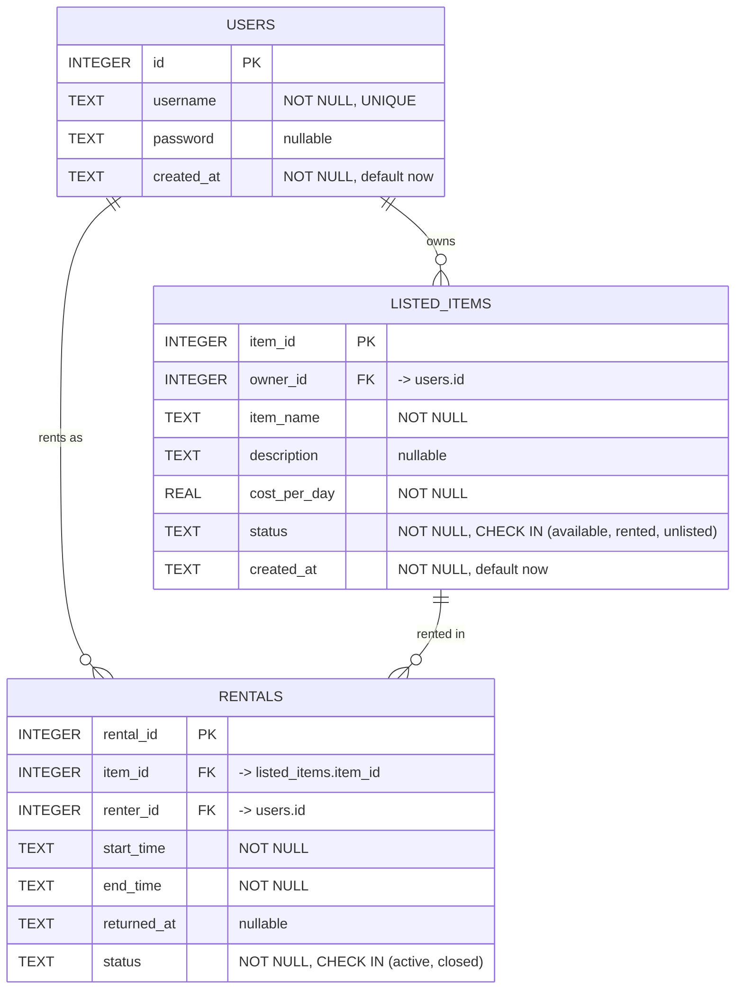

# Rental Tracker — ER Diagram

GitHub renders this Mermaid diagram natively when you view this file in the repo.

If your reviewer wants a standalone image rather than a rendered markdown file,
paste the mermaid block above into https://mermaid.live and export as PNG/SVG.
